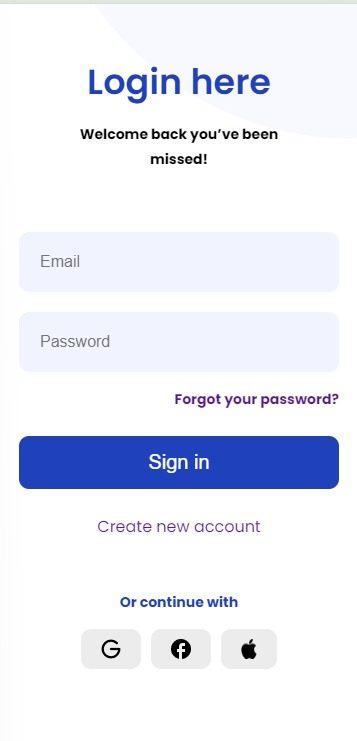
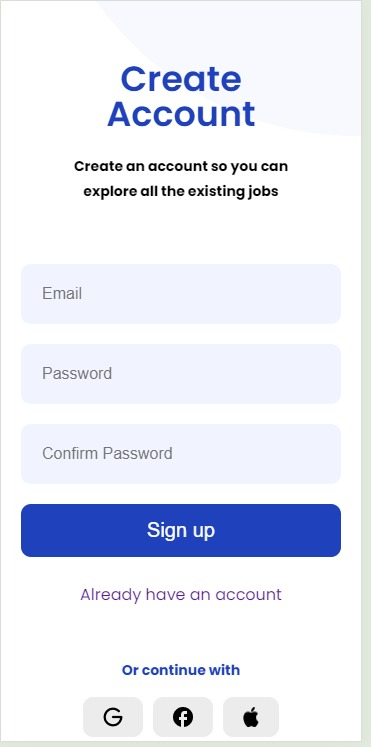
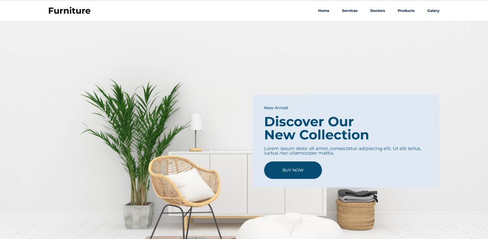
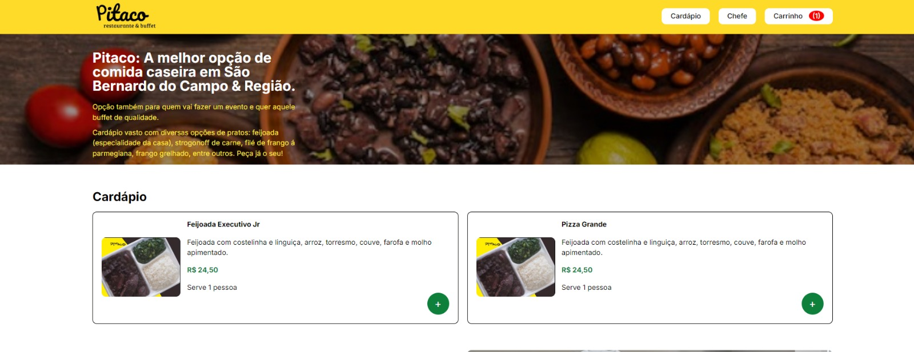
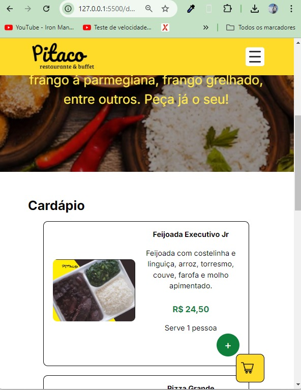

# DailyFigmaLayouts

## Descrição

Bem-vindo ao meu desafio pessoal! Neste repositório, eu recrio um layout diferente do Figma todos os dias. O objetivo é melhorar minhas habilidades em HTML, CSS e JS enquanto pratico a recriação de designs reais.

Cada pasta contém o layout de um dia, com o código-fonte e uma captura de tela do design original.

---

## Estrutura do Repositório

- `day-01/`: Primeiro layout copiado
- `day-02/`: Segundo layout copiado
- `...`

---

## Capturas de Tela

Aqui estão algumas capturas de tela dos layouts recriados até agora:

### Day 01
<div style={ display: flex; gap: 50px; flex-wrap: wrap; }>
   
   
   
</div>


### Day 02
<div style={ display: flex; gap: 50px; flex-wrap: wrap; }>

</div>

### Day 04
<div style={ display: flex; gap: 50px; flex-wrap: wrap; }>


</div>

---

## Objetivo

O objetivo deste repositório é praticar a recriação de interfaces no código, a partir de designs no Figma. A prática diária me ajuda a melhorar em:

- Uso de CSS moderno
- Flexbox e Grid Layout
- Responsividade
- Atenção aos detalhes visuais

---

## Como visualizar os layouts

1. Clone o repositório:
   ```bash
   git clone https://github.com/seu-usuario/DailyFigmaLayouts.git
